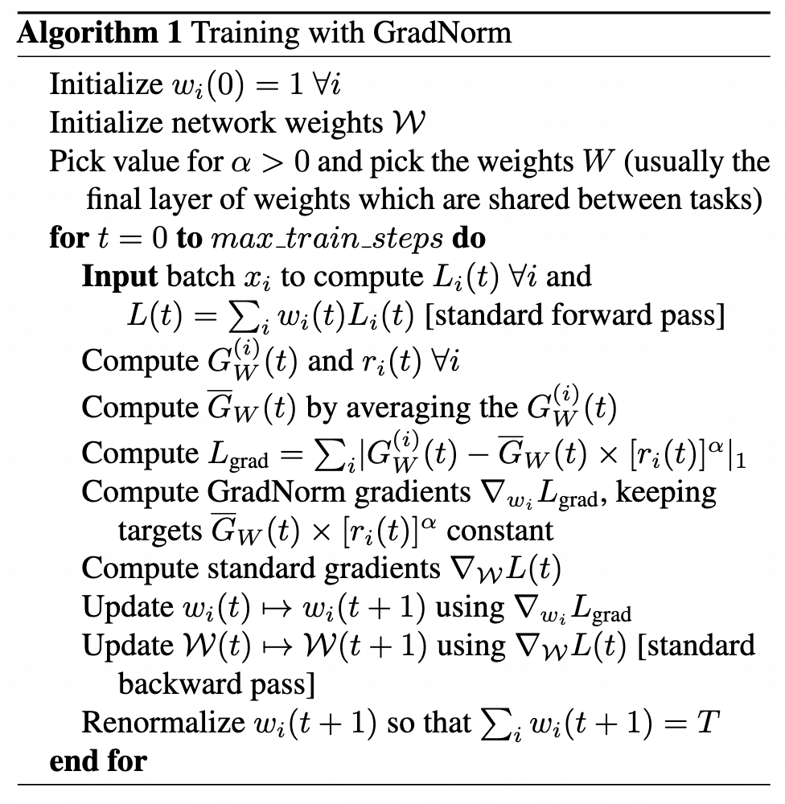

# 多任务学习loss
一般排序模型有多个训练任务，需要预测多个目标，比如电商的点击、加购、下单以及短视频平台的点击、点赞、评论、播放时长等。不同任务的梯度大小不同，而且方向也不一致，这会产生如下问题：
- **大小不一致**：如果梯度大小不一致，那么不同任务的收敛速度不一致，有的任务可能已经收敛，有的任务离最优点还差很多。
- **方向不一致**：如果梯度方向不一致，那么就会产生梯度冲突，a任务希望参数往这个方向变化，但b任务却希望参数往反方向变化，这就是产生矛盾，影响模型的训练速度和质量。

一般多任务学习loss一般关注一下三个方面：
1. **magnitude**：loss值的大小不同，出现大loss主导现象，怎么办？
2. **学习速度**：任务的难易程度不同，导致不同任务的收敛速度不同，怎么办？
3. **梯度冲突**：多个任务的梯度方向不同，出现跷跷板现象，怎么办？

## 不确定性损失
论文：[Multi-Task Learning Using Uncertainty to Weigh Losses for Scene Geometry and Semantics](https://arxiv.org/pdf/1705.07115)

主要思想是对于不确定性大的任务，loss权重小，对于不确定性小的任务，loss权重大。使用可学习参数 $\sigma$ 来度量任务的不确定性：

$$
L_{task_i} = \frac{1}{2 \sigma_i^2} L_i + \text{log} \sigma_i
$$

代码实现中，一般为了保证损失非负，$\text{log} \sigma_i$ 会使用 $\log (1 + \sigma_i)$。而且由于需要保证 $\sigma_i > 0$ 且 $2 \sigma_i^2$ 需要初始化为1 ，所以一般定义可学习参数 $\sigma = e^x$，其中 $x$ 是可学习参数，初始化为 $\text{ln} \frac{1}{\sqrt{2}}$。

## GradNorm
论文：[Gradient Normalization for Adaptive Loss Balancing in Deep Multitask Networks](https://proceedings.mlr.press/v80/chen18a/chen18a.pdf)

核心动机：任务之间的不平衡最终表现为反向传播梯度之间的不平衡（过于强势的任务，其梯度幅度值也更大）。当任务相对于其他任务训练过快，则需要限制其梯度，否则就放大其梯度。

**关键量定义**

**梯度相关：**
- $\mathcal{W}$： 施加GradNorm的参数，一般选择共享网络的最后一层参数。
- $G_{\mathcal{W}}^{(i)}(t) = \left\lVert \nabla_{\mathcal{W}}\, w_i(t)L_i(t) \right\rVert_2$：第 $t$ 步，加权单任务损失 $w_i(t)L_i(t)$ 对所选权重 $\mathcal{W}$ 的梯度的 L2 范数。
- $\bar{G}_{\mathcal{W}}(t) = \mathbb{E}_{task}\left[G_{\mathcal{W}}^{(i)}(t)\right]$：第 $t$ 步，所有任务梯度范数的平均值，作为比较各任务梯度大小的公共尺度。

**训练速率相关：**
- $\tilde{L}_i(t) = L_i(t)/L_i(0)$：损失比率（loss ratio），是任务 $i$ 训练速率的**逆**度量——$\tilde{L}_i(t)$ 越小，说明该任务训练得越快。
- $r_i(t) = \tilde{L}_i(t)/\mathbb{E}_{task}\left[\tilde{L}_i(t)\right]$：相对逆训练速率（relative inverse training rate），即任务 $i$ 的损失比率除以所有任务损失比率的平均值。$r_i(t)$ 越大，说明该任务训练得越慢，应给它更大的梯度来加速。

> 注：若 $L_i(0)$ 对初始化过于敏感，则
> - 理论初始损失：可用理论初始损失代替（如 $C$ 类交叉熵用 $\log C$），此时分类器为一个随机分类器。
> - warm-up平均：取前 $k$ 步的损失平均值作为初始损失 $L_i(0)$。
> - 多次采样平均：训练前用多个不同的batch做前向传播，取平均损失；

**目标梯度范数与GradNorm损失**

每个任务 $i$ 的目标梯度范数定义为：$\bar{G}_{\mathcal{W}}(t) \times [r_i(t)]^{\alpha}$ ，其中 $\bar{G}_{\mathcal{W}}(t)$ 是所有任务梯度范数的平均值，表示所有任务的平均梯度，$r_i(t)$ 是任务 $i$ 的相对逆训练速率，表示该任务的训练速率，$\alpha$ （不对称度）是用于调节梯度范数的超参数。这个目标梯度范数是理想情况下的梯度范数，即根据各个任务的训练速度，动态调节每个任务的对应梯度，使得所有任务的梯度保持相对一致。

故可以定义GradNorm损失 —— 实际梯度范数与目标梯度范数的L1损失，让每个任务的实际梯度逐渐往目标梯度靠拢，从而更新每个任务的权重 $w_i(t)$：

$$
L_{grad}(t;w_i(t)) = \sum_i \left|G_{\mathcal{W}}^{(i)}(t) - \bar{G}_{\mathcal{W}}(t) \times [r_i(t)]^{\alpha} \right|
$$

然后再用 $\nabla_{w_i(t)}\, L_{grad}$ 的梯度来更新 $w_i(t)$。注意，目标梯度范数这一项视作常数。更新完 $w_i(t)$ 后，需要重新归一化权重，使 $\sum_i w_i(t) = T$。

接着正常更新模型参数：使用 $\nabla_{\mathcal{W}(t)}\, L(t)$ 来更新 $\mathcal{W}(t)$。

详细的算法流程如下：

## 
